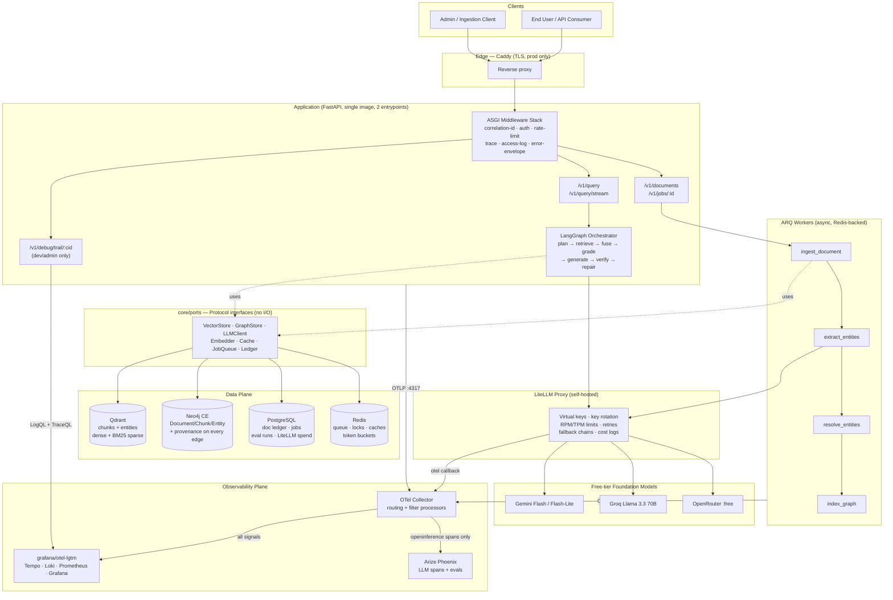
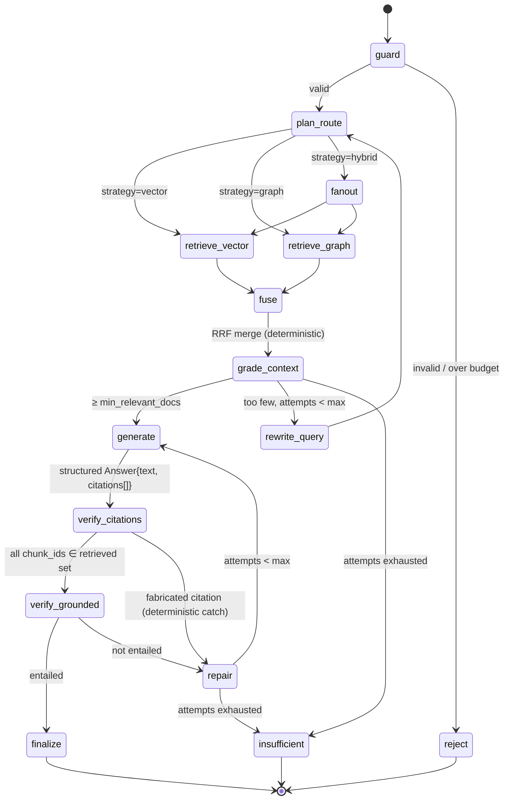
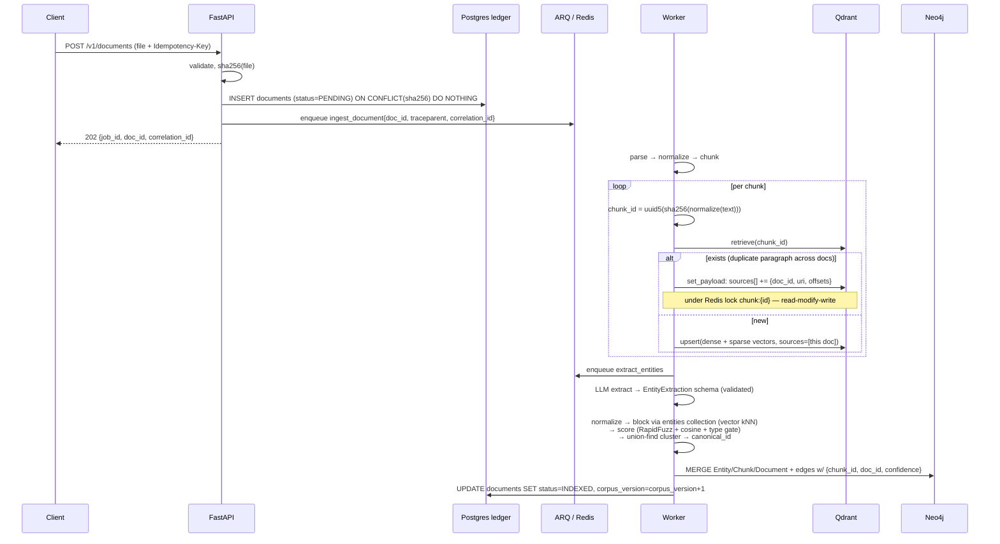

# Hybrid GraphRAG — Production MVP Architecture

**Status:** Design v1.0 · **Target:** 4-day build, ₹0 cost, production-grade tooling
**Audience:** you (builder) + campus placement interviewers reading the repo

> ⚠️ **This document explains WHY. It is not the implementation spec.**
> `BLUEPRINT.md` is authoritative for every name, signature, value and shape; where the two
> disagree, BLUEPRINT wins and the disagreement is a defect worth reporting.
> Code blocks here are illustrative sketches, some containing literal `...` placeholders.
> **Appendix A deliberately documents designs that were rejected** — it exists so the reasoning
> is on record. Never implement from it.

---

## 0. Scope Reality Check (read this first)

The system you described is roughly **12–18 engineer-days** of honest work. Four days buys you
a *complete, coherent vertical slice* of it — which is actually **better for a CV** than a
half-finished attempt at everything, because you can defend every line in an interview.

The design below is **layered so nothing gets thrown away**. T0 is the 4-day build. T1/T2 are
wired for but not implemented — they live in the README as a roadmap, and the ports/interfaces
already exist so an interviewer can see you designed for them.

| Tier | Contents | When |
|---|---|---|
| **T0 — Ship** | Config spine · observability spine · async ingestion · content-addressed chunk dedup w/ multi-source retention · hybrid dense+sparse retrieval · LLM entity/relation extraction · deterministic entity resolution · Neo4j graph w/ provenance · LangGraph router (vector ∥ graph ∥ hybrid) · schema-validated LLM I/O with repair loop · groundedness verification · LiteLLM gateway w/ fallbacks · error envelope + trail extractor · Docker Compose · eval harness + 50-item golden set · tests | Days 1–3.5 |
| **T1 — Stretch** | Phoenix LLM-as-judge in CI · Grafana dashboards · semantic cache · cross-encoder rerank · LLM adjudication for ambiguous entity merges · Text2Cypher (sandboxed) | Day 4 |
| **T2 — Roadmap (README only)** | Splink probabilistic ER · Leiden community detection + global/thematic summaries · multi-tenant isolation · K8s/Helm · HA | Post-submission |

**The single most important scoping decision:** *do not* build free-form Text2Cypher in the MVP.
Use a small library of **parameterized Cypher templates** that the router selects. It is safer,
faster, testable, and demonstrates better judgment than a text-to-query toy. See §8.3.

---

## 1. Architecture Diagram

### 1.1 System context & component map



### 1.2 Query data flow (the self-correcting state machine)



### 1.3 Ingestion flow (source retention + entity resolution)



---

## 2. Component Breakdown

Layout is **hexagonal (ports & adapters)**. The rule: `core/` imports nothing from `adapters/`.
That single rule is what makes every component independently rewritable, mockable, and testable —
and it is the thing to point at when an interviewer asks "how would you swap Neo4j for Memgraph?"

```
graphrag/
├── config/
│   ├── settings.py            # Pydantic Settings — the ONLY place env/YAML is read
│   ├── base.yaml              # defaults, committed
│   ├── local.yaml             # dev overrides, committed
│   ├── prod.yaml              # prod overrides, committed
│   └── .env                   # SECRETS ONLY, gitignored
├── core/                      # pure domain — zero I/O, the leaf layer (see BLUEPRINT §1a)
│   ├── models.py              # Chunk, SourceRef, Entity, Relation, Answer, Citation…
│   ├── events.py              # versioned job/event payload schemas
│   ├── ports.py               # Protocol: VectorStore, GraphStore, LLMClient, Embedder…
│   └── errors.py              # AppError hierarchy → error codes
├── services/                  # use cases — depend only on core.ports
│   ├── ingestion/             # parse, chunk, dedup, source-retention
│   ├── resolution/            # entity resolution pipeline
│   ├── retrieval/             # vector, graph, fusion
│   └── orchestration/         # LangGraph nodes + graph assembly
├── adapters/                  # the only code that touches the outside world
│   ├── qdrant_store.py  neo4j_store.py  postgres_ledger.py  redis_cache.py
│   ├── litellm_client.py      # structured_call() with validation + repair
│   ├── fastembed_embedder.py
│   └── telemetry/             # otel setup, structlog config, decorators, middleware
├── apps/
│   ├── api/                   # FastAPI app, routers, middleware, error handlers
│   ├── worker/                # ARQ WorkerSettings + task registry
│   └── cli/                   # ingest, reindex, eval, trail
├── evaluation/
│   ├── golden/                # 50 Q/A YAML fixtures
│   ├── retrieval_metrics.py   # Recall@k, MRR, nDCG — deterministic, no LLM
│   └── judges.py              # Phoenix / RAGAS wrappers
└── tests/  unit/ integration/ eval/ contract/
```

### 2.1 API Layer (`apps/api`)
Thin. Its only jobs: authenticate, validate, translate DTO→domain, call a service, map errors.
No business logic in routers — if a router body exceeds ~15 lines, logic leaked in.

| Endpoint | Purpose | Notes |
|---|---|---|
| `POST /v1/query` | Sync answer | Returns answer + citations + route taken + `correlation_id` |
| `POST /v1/query/stream` | SSE token stream | Emits `node_start`/`node_end` events → live view of the state machine (great demo) |
| `POST /v1/documents` | Async ingest | Requires `Idempotency-Key`; returns `202` + `job_id` |
| `GET /v1/jobs/{id}` | Job status | State machine: PENDING→PARSING→EMBEDDING→EXTRACTING→RESOLVING→INDEXED / FAILED |
| `DELETE /v1/documents/{id}` | Refcount-aware delete, **async** | Returns `202` + `job_id`. Qdrant has no atomic "remove element from payload array", so the worker must scroll every point where `sources[].doc_id == id`, rewrite each array, and delete points whose `sources` emptied. On a heavily chunked document that read-modify-write loop will blow past an HTTP timeout — it belongs in a job, not the request path. Must delete from Neo4j in the same job (see §6.2). |
| `GET /v1/debug/trail/{cid}` | Error trail bundle | Admin key + `env != prod`; §3.4 |
| `GET /healthz` `/readyz` | Liveness / readiness | `readyz` pings Qdrant, Neo4j, Postgres, Redis, LiteLLM |
| `GET /metrics` | Prometheus scrape | Optional — OTLP push is primary |

### 2.2 Orchestrator (`services/orchestration`) — LangGraph
Each node is a **pure function** `(State) -> dict[str, Any]` (a partial state update). This makes
every node unit-testable without a running graph, which is the whole reason to use LangGraph over
an if/else chain.

```python
import operator
from typing import Annotated

def merge_counters(a: dict[str, int], b: dict[str, int]) -> dict[str, int]:
    return {k: a.get(k, 0) + b.get(k, 0) for k in a | b}

# Budget accumulates SPEND, never "remaining". See the warning below.
def merge_spend(a: Spend, b: Spend) -> Spend:
    return Spend(llm_calls=a.llm_calls + b.llm_calls,
                 tokens=a.tokens + b.tokens,
                 wall_ms=max(a.wall_ms, b.wall_ms))   # wall-clock is parallel, so max not sum

class QueryState(TypedDict):
    correlation_id: str
    question: str
    plan: RoutePlan | None
    # written by ONE node each — default last-write-wins is correct
    vector_hits: list[ScoredChunk]
    graph_hits: list[GraphPath]
    fused: list[ScoredChunk]
    graded: list[ScoredChunk]
    answer: Answer | None
    # written by MULTIPLE nodes, including two that run in parallel.
    # These MUST carry reducers — see the warning below.
    failures: Annotated[list[NodeFailure], operator.add]
    attempts: Annotated[dict[str, int], merge_counters]
    spent:    Annotated[Spend, merge_spend]   # remaining = limits - spent, computed on read
```

> ⚠️ **This is the single easiest way to break this design.** LangGraph's default merge rule is
> last-write-wins: a node's returned value replaces the field's current value. Two consequences,
> and the second is worse than the first:
>
> 1. Without a reducer, `failures` is *overwritten*, not appended — so the "append-only audit
>    trail" this document promises silently doesn't exist.
> 2. `retrieve_vector` and `retrieve_graph` **fan out in parallel**. If two nodes run side by side
>    and both return the same key without a reducer, LangGraph raises `InvalidUpdateError`. So the
>    first time both retrievers record a failure in the same super-step, the request crashes.
>
> Reducers are therefore load-bearing, not stylistic. If a node ever needs to *reset* an
> accumulating field rather than extend it, return `Overwrite(value=...)`
> (`from langgraph.types import Overwrite`) — the reducer is bypassed and the channel is set
> directly. Nothing in this design needs it; it's noted so nobody reimplements it by hand.

> ⚠️ **Track spend, not remaining budget — and make the reducer a monoid.** An earlier version of
> this design stored *remaining* budget and merged parallel branches with `min()`. That silently
> leaks quota: starting from 10 calls, if the vector branch spends 3 (returns 7) and the graph
> branch spends 5 (returns 5), `min` gives 5 — but 8 were actually spent, so the true remainder is
> 2. The system then happily runs three calls it has no budget for, every single query.
>
> The rule is that a reducer must be **associative and commutative**, because LangGraph applies
> updates at the end of a super-step in no guaranteed order. `min` over remaining balances is
> commutative but not *conservative* — it isn't a valid aggregation of the underlying quantity at
> all. Accumulating spend with `+` is: the sum is order-independent and exact. Wall-clock is the
> one exception — parallel branches overlap in time, so it aggregates with `max`, not `+`.
>
> Read remaining as `limits - spent` at the point of use. Never store it.

Nodes and their contracts:

| Node | Input → Output | LLM? | Failure mode & handling |
|---|---|---|---|
| `guard` | question → validated | no | Reject >`max_query_chars`, empty, or budget-exhausted → `400`/`429` |
| `plan_route` | question → `RoutePlan{strategy, entities[], hops, sub_queries[], rationale}` | yes (fast) | Schema violation → repair loop → after N, **default to `hybrid`** (fail-open to the more expensive but safer path) |
| `retrieve_vector` | query → top-k chunks | no | Qdrant down → `failures[]` + continue with graph only |
| `retrieve_graph` | entities → paths ≤ `max_hops` | no | Entity link miss → empty, not error |
| `fuse` | two ranked lists → one | **no** | Pure RRF. Deterministic on purpose — no LLM in the merge step |
| `grade_context` | chunks → `RelevanceGrade{relevant: bool, reason}` per chunk | yes (fast, batched) | Grader failure → treat as relevant (fail-open), log `grader_degraded` |
| `rewrite_query` | question + failure → new question | yes (fast) | Bounded by `max_rewrites` |
| `generate` | graded chunks → `Answer{text, citations[], confidence}` | yes (synth) | Schema violation → repair |
| `verify_citations` | Answer → bool | **no** | **Deterministic**: every `citations[].chunk_id` must exist in `graded`. Catches the most common hallucination (invented sources) for zero tokens |
| `verify_grounded` | Answer + chunks → `Entailment{supported, unsupported_spans[]}` | yes (judge, *different provider*) | Not entailed → `repair` with the unsupported spans as feedback |
| `repair` | failure → retry or give up | no | Bounded by `max_repair_attempts` |
| `insufficient` | — | no | Returns `"I don't have enough grounded evidence"` + what *was* retrieved. **This node is the product.** A RAG system that refuses correctly beats one that always answers. |

### 2.3 Ingestion (`services/ingestion`)
- **Parse:** `unstructured` (or `pymupdf` + `python-docx` for a leaner image) → plain text + page offsets.
- **Chunk:** recursive character splitter, `chunk_size` / `chunk_overlap` from config, respecting sentence boundaries. Keep `char_start`/`char_end` — you need them for citation highlighting.
- **Normalize for hashing:** NFKC → collapse whitespace → strip zero-width → casefold. Hash the *normalized* text, store the *original*.
- **Content addressing:** `chunk_id = uuid.UUID(bytes=sha256(normalized).digest()[:16], version=5)`.
  Two documents sharing a paragraph produce the *same* point ID — dedup is a property of the ID
  scheme, not a search.
  > **`version=5` is not optional.** `uuid.UUID(bytes=...)` alone leaves the version and variant
  > nibbles as whatever the hash happened to emit — you get an accidental "version" (3, 7, 0…)
  > that varies per input and means nothing. Passing `version=` makes Python set bits 12–15 and
  > 64–65 per RFC 4122 while leaving the other 122 bits untouched, so the ID stays fully
  > deterministic and is now spec-valid. Verified: same input → same UUID, `.version == 5`.
  >
  > **Don't "fix" this by switching to a 64-bit integer ID.** Qdrant does accept unsigned ints,
  > but truncating to 64 bits drops collision resistance from a ~2⁶⁴ birthday bound to ~2³², which
  > is a real risk for a content-addressed store and a strictly worse trade than setting two
  > nibbles correctly.
  >
  > Also don't use `uuid5(NAMESPACE, sha256_hex)`: RFC 4122 `uuid5` hashes its input with SHA-1
  > internally, so that hashes the content twice for no benefit — and you compute the SHA-256
  > anyway for the `content_hash` payload field.
- **Source retention:** the `sources[]` payload array is append-only per doc, refcounted on delete. This is the requirement you called out, and content addressing is what makes it cheap.

### 2.4 Entity Resolution (`services/resolution`)
This is the component most CV projects fake. Do it properly — it is the strongest interview story
in the whole build. The pipeline mirrors the standard record-linkage stages — schema alignment,
blocking, entity resolution, canonicalization — as reviewed in Steorts, *A Primer on the Data
Cleaning Pipeline* ([arXiv:2307.13219](https://arxiv.org/abs/2307.13219)), which surveys the
Fellegi–Sunter (1969) framework and Christen's indexing/blocking work:

1. **Extract** — LLM call returning validated `EntityExtraction{entities: [{surface, type, span}], relations: [{src, dst, type, evidence_span}]}`. Run on the **bulk** model (high TPM) — see §4.3.
2. **Normalize** — NFKC, casefold, strip legal suffixes (`Inc|Ltd|LLC|Corp|Pvt`), strip honorifics, collapse punctuation. Deterministic and unit-testable with `hypothesis`.
3. **Block (candidate generation)** — the step that avoids O(n²). Two blockers, unioned:
   - exact `normalized_name` lookup (Postgres/Neo4j index)
   - **vector blocking**: kNN over the `entities` Qdrant collection on the name embedding, top-`block_k`
4. **Score** — for each candidate pair: `w1·jaro_winkler + w2·token_set_ratio (RapidFuzz) + w3·cosine(name_emb)`, hard-gated on `type` equality. Weights in config.
5. **Decide** — three bands from config:
   - `score ≥ auto_merge_threshold` → merge
   - `score ≤ auto_reject_threshold` → distinct
   - between → **gray band**: T0 leaves distinct + flags; T1 sends *only these* to an LLM adjudicator (cheap, because it is a tiny fraction of pairs)
6. **Cluster** — union-find over merge edges → `canonical_id`. Canonical name = highest-frequency surface form. Losers become `(:Entity)-[:ALIAS_OF]->(:Entity)` — **never deleted**, so every merge is auditable and reversible.
7. **Persist** — `MERGE` into Neo4j; upsert canonical name vector into Qdrant `entities`.

> **Roadmap credibility:** README states T2 replaces steps 4–5 with [Splink](https://pypi.org/project/splink/) (Fellegi–Sunter, DuckDB backend, unsupervised EM — no labelled data needed, links ~1M records on a laptop in about a minute). Naming the exact upgrade path is what makes the MVP read as *scoped*, not *naive*.

### 2.5 Retrieval (`services/retrieval`)

Fusion happens **twice, at two different layers**. Be precise about this — it is a common source of
confusion when reading the diagram:

| Stage | What is fused | Where it runs |
|---|---|---|
| **1. Intra-store** | dense vs sparse, both inside Qdrant | **Server-side.** One `query_points` call with two `prefetch` branches and `RrfQuery` — no client merge code for this step |
| **2. Cross-store** | Qdrant results vs Neo4j results | **Client-side, in Python.** Qdrant cannot fuse its own vectors with rows that came from a different database |

- **Vector path:** [Universal Query API](https://qdrant.tech/documentation/search/hybrid-queries/), `prefetch` dense (`bge-small-en-v1.5`) + sparse (BM25), fused server-side:
  ```python
  client.query_points(
      "chunks",
      prefetch=[models.Prefetch(query=dense_vec,  using="dense", limit=cfg.prefetch_limit),
                models.Prefetch(query=sparse_vec, using="bm25",  limit=cfg.prefetch_limit)],
      query=models.RrfQuery(rrf=models.Rrf(k=cfg.rrf_k, weights=cfg.weights)),
      limit=cfg.top_k, with_payload=True,
  )
  ```
  Two fusion objects exist in `qdrant-client` and both are valid: `FusionQuery(fusion=Fusion.RRF)`
  is the parameterless form, while `RrfQuery(rrf=Rrf(k=…, weights=…))` exposes the `k` constant and
  per-branch weights. **Use `RrfQuery`** — `rrf_k` and `fusion.weights` are config-tunable in this
  design (§2.5, cross-store fusion), and `FusionQuery` gives you nowhere to put them. Verified
  against `qdrant-client` 1.19.0.

  🚨 **The sparse vector collection MUST be created with `modifier=Modifier.IDF`.** `Qdrant/bm25`
  in fastembed emits only the *term-frequency* half of the BM25 formula; inverse document
  frequency depends on whole-corpus statistics, so Qdrant computes it at query time from live
  collection stats — but only if the modifier is set. Two reasons this is a 🚨 and not a note:
  omitting it raises **no error** (you get raw TF matching that over-weights common tokens and
  quietly degrades the sparse leg), and **you cannot add it later without recreating the
  collection.** Set it on day one.
  ```python
  client.create_collection(
      "chunks",
      vectors_config={"dense": models.VectorParams(size=384, distance=models.Distance.COSINE)},
      sparse_vectors_config={"bm25": models.SparseVectorParams(modifier=models.Modifier.IDF)},
  )
  ```
- **Graph path:** entity-link the query mentions against the `entities` collection → seed nodes →
  parameterized Cypher template, `≤ max_hops` (default 2) → collect the `chunk_id` on every
  traversed edge → hydrate the chunk text. **The graph returns provenance, not prose.**

  ⚠️ **Every template needs a degree cap, not just a result `LIMIT`.** A bare `LIMIT` is applied
  *after* expansion, so a hub entity with thousands of edges makes Neo4j do the full traversal and
  then throw most of it away. Rank and truncate inside the pattern (`ORDER BY r.confidence DESC
  LIMIT $per_hop_cap` per hop), and set `max_degree` in config. This is a query-latency guard;
  `fusion.final_top_k` already bounds what reaches the LLM.
- **Cross-store fusion:** Reciprocal Rank Fusion over the two ranked lists. RRF uses only rank, so
  it sidesteps the incompatible-score problem (cosine ∈ [−1,1] vs unbounded BM25 vs graph path
  cost) without normalization hacks. Note the trade-off honestly: stage 2 discards the stage-1
  scores and re-ranks by position, so a chunk that dominated the dense leg carries no extra weight
  into the merge. Acceptable at MVP scale; if it shows up in eval, the fix is a weighted RRF
  (`fusion.weights` is already in config) or a cross-encoder rerank (T1).

### 2.6 LLM Gateway (`adapters/litellm_client.py` + LiteLLM proxy)
The app **never** holds a provider key. It holds one virtual key and one base URL. Everything else
— rotation, RPM/TPM caps, retries, provider fallback, spend logging — is proxy config. See §4.3.

App-side wrapper adds the one thing the proxy can't: **schema enforcement with a repair loop**.

```python
async def structured_call(*, role: ModelRole, prompt: str, schema: type[T],
                          max_repairs: int) -> T:
    """Call → parse → on ValidationError re-prompt with the error → raise after N."""
```
Emits a span with `llm.role`, `llm.repair_attempts`, `llm.schema`, token counts.

---

## 3. Observability Strategy

### 3.1 One spine, three signals, two sinks

**OpenTelemetry is the only instrumentation API in the codebase.** Everything — logs, traces,
metrics, LLM spans — is emitted as OTLP to a local Collector, which fans out.

- **Traces:** `opentelemetry-instrumentation-fastapi` + `-httpx` + `-redis` + `-asyncpg` (auto) plus `@traced` decorators on service methods (manual). LLM/retrieval spans come from **OpenInference** instrumentors (`openinference-instrumentation-langchain`), which emit OTel spans with `openinference.span.kind` attributes.
- **Logs:** `structlog` → JSON → `OTLPLogExporter`. `structlog.contextvars.merge_contextvars` puts request-scoped fields on *every* log line automatically.
- **Metrics:** OTel Meter. RED metrics free from auto-instrumentation; domain metrics declared once in `telemetry/metrics.py`.

**Why a Collector at all, if both backends speak OTLP?** Because it decouples the app from the
backends. Adding, removing, or repointing a sink (e.g. to Grafana Cloud in prod) is a Collector
config change, not an app redeploy. That single property is worth the extra container.

```yaml
# otel/collector.yaml
receivers:
  otlp: { protocols: { grpc: { endpoint: 0.0.0.0:4317 }, http: { endpoint: 0.0.0.0:4318 } } }
processors:
  batch: { timeout: 2s, send_batch_size: 512 }
  memory_limiter: { check_interval: 1s, limit_percentage: 75, spike_limit_percentage: 15 }
exporters:
  otlp/lgtm:    { endpoint: otel-lgtm:4317, tls: { insecure: true } }
  otlp/phoenix: { endpoint: phoenix:4317,   tls: { insecure: true } }
service:
  pipelines:
    # Both sinks get the COMPLETE trace. See the warning below.
    traces:  { receivers: [otlp], processors: [memory_limiter, batch], exporters: [otlp/lgtm, otlp/phoenix] }
    logs:    { receivers: [otlp], processors: [memory_limiter, batch], exporters: [otlp/lgtm] }
    metrics: { receivers: [otlp], processors: [memory_limiter, batch], exporters: [otlp/lgtm] }
```

> ⚠️ **Do not filter LLM spans out of the Phoenix pipeline.** The obvious-looking optimisation —
> a `filter` processor that keeps only spans carrying `openinference.span.kind` — is wrong for two
> independent reasons:
>
> 1. **It orphans the spans you care about.** The filter processor *drops* telemetry; dropping a
>    span that is a parent orphans its children. Your LLM spans are nested under HTTP and service
>    spans. Strip those and Phoenix receives disconnected fragments instead of a call tree —
>    losing exactly the parent context that makes a trace worth reading.
> 2. **The config shape has moved.** Filtering now uses OTTL conditions (`traces: { span: [...] }`)
>    rather than the legacy `match_type` / `expressions` style, and the `include` semantics
>    ("keep only what matches") were removed — the processor only drops on match, so an
>    allow-list has to be written as a negated drop condition.
>
> Send whole traces to both. Phoenix renders non-LLM spans as ordinary spans and keeps the tree
> intact; at MVP volume the duplication costs nothing. If volume ever matters, reduce it at
> *trace* granularity with the `tailsampling` processor or a `routing` connector — never by
> dropping spans from the middle of a trace.

**Backend:** `grafana/otel-lgtm` — one container bundling OTel Collector + Prometheus + Tempo +
Loki + Grafana, zero config, OTLP on 4317/4318, Grafana on 3000. It is explicitly a dev/demo image
(no HA, no persistence guarantees), which is exactly right for T0; §7 covers the production split.

### 3.2 Correlation IDs that survive the async boundary
This is the requirement that most designs get wrong. Three IDs, one lineage:

| ID | Origin | Lifetime |
|---|---|---|
| `correlation_id` | `X-Correlation-ID` header, else ULID generated in middleware | The whole user-visible operation, **including background jobs** |
| `trace_id` | OTel, per process-level operation | One trace |
| `job_id` | ARQ | One job |

The API→worker hop breaks W3C context propagation unless you carry it explicitly:

```python
# --- enqueue side (API process) ---
carrier: dict[str, str] = {}
TraceContextTextMapPropagator().inject(carrier)          # {"traceparent": "00-..."}
await redis.enqueue_job(
    "ingest_document",
    JobEnvelope(payload=..., correlation_id=cid, otel=carrier),   # a JOB ARGUMENT
    _job_id=idempotency_key,                                      # ARQ dedups on this
)

# --- worker side ---
# `ctx` is ARQ's own dict (redis conn, job_id, enqueue_time, job_try) — it does NOT carry
# your payload. The envelope arrives as a normal positional parameter, so declare it:
async def ingest_document(ctx: dict, env: JobEnvelope) -> None:
    parent = TraceContextTextMapPropagator().extract(env.otel)
    with tracer.start_as_current_span("ingest_document", context=parent):
        structlog.contextvars.bind_contextvars(
            correlation_id=env.correlation_id, job_id=ctx["job_id"], job_try=ctx["job_try"],
        )
        ...
```
Result: one Tempo trace spans HTTP request → queue → worker → Qdrant → LiteLLM → Gemini.

### 3.3 Instrumentation without cluttering business logic
Four mechanisms, in order of preference:

1. **Auto-instrumentation** — HTTP, Redis, Postgres, httpx, LangChain/LangGraph. Zero code.
2. **ASGI middleware** (correlation ID, access log, error envelope, rate limit). Use *pure ASGI*
   middleware, not `@app.middleware("http")` — the decorator form runs in a different context and
   **loses contextvars bound inside the endpoint**, so your enriched fields silently vanish from
   the access log.
3. **Decorators** at the service boundary:
   ```python
   @traced(name="resolution.resolve_batch", record_args=["batch_size"])
   @counted(metric="entities_resolved_total", labels=["outcome"])
   async def resolve_batch(self, mentions: list[Mention]) -> list[Entity]: ...
   ```
   `@traced` opens a span, records typed args (allowlisted — never `**kwargs`), sets
   `span.status = ERROR` + `record_exception` on raise, and closes. Business logic is untouched.
4. **A structlog processor chain** applied once at startup, adding `service`, `env`, `version`,
   `config_hash`, `trace_id`, `span_id`, `correlation_id` to every line:
   ```python
   def add_otel_context(_, __, ev):
       sc = trace.get_current_span().get_span_context()
       if sc.is_valid:
           ev["trace_id"] = format(sc.trace_id, "032x")
           ev["span_id"]  = format(sc.span_id, "016x")
       return ev
   ```

**Rule:** if a business function contains the word `logger` more than twice, the logging belongs in
a decorator. The exception is *domain events* — `log.info("entity_merge_decided", score=..., band=...)` —
which are the whole point of structured logs and should be explicit.

### 3.4 Error trails you can paste back to an LLM

Every error response carries the IDs:

```json
{
  "error": {
    "code": "RETRIEVAL_BACKEND_UNAVAILABLE",
    "message": "Vector store did not respond within 2000ms",
    "correlation_id": "01J8X...",
    "trace_id": "4bf92f3577b34da6a3ce929d0e0e4736",
    "retryable": true,
    "details": {"backend": "qdrant", "attempts": 3}
  }
}
```

Then `graphrag trail <correlation_id>` (CLI, and `GET /v1/debug/trail/{cid}` in dev):

1. Query Loki: `{service_name="graphrag"} | json | correlation_id="01J8X..."`
   (the label is `service_name` — Loki's OTLP ingestion converts the `service.name` resource
   attribute by replacing dots with underscores; `{service=...}` silently matches nothing)
2. Query Tempo (TraceQL): `{ .app.correlation_id = "01J8X..." }`
3. Merge into one time-ordered sequence, redact secrets, truncate prompts to `n` chars
4. Emit `debug_bundle_<cid>.md`: config hash, route taken, per-node timings, every failure with
   stack, LLM calls with model + attempt count, and the final error

That file is directly pasteable into a chat for debugging — which is precisely what you asked for,
and it is a genuinely uncommon thing to see in a student project.

### 3.5 Metrics worth having (all names in config, all with `env`/`version` labels)

| Metric | Type | Why |
|---|---|---|
| `http.server.request.duration` | histogram | RED, free from auto-instr |
| `graphrag.route.selected` | counter{strategy} | Is the router actually routing, or always picking hybrid? |
| `graphrag.retrieval.latency` | histogram{backend} | vector vs graph cost |
| `graphrag.repair.attempts` | histogram{node} | **The health metric.** Rising = model or prompt drift |
| `graphrag.answer.refused` | counter{reason} | Refusal rate — should be non-zero |
| `graphrag.citations.invalid` | counter | Fabricated citations caught deterministically |
| `graphrag.llm.tokens` | counter{model,role,direction} | Cost, cross-checked against LiteLLM spend |
| `graphrag.llm.rate_limited` | counter{provider} | Free-tier headroom |
| `graphrag.ingest.chunks.deduped` | counter | Proves source retention is working |
| `graphrag.entities.merged` | counter{band} | auto / gray / rejected split |

---

## 4. Tech Stack — Decisions, Reasons, Sources

### 4.1 Core runtime

| Choice | Reason | Source consulted |
|---|---|---|
| **Python 3.12** | Only ecosystem with first-class LangGraph + LiteLLM + Qdrant + Neo4j + OTel + Phoenix. Non-negotiable here. | — |
| **FastAPI + Uvicorn** | Pydantic-native (same models validate HTTP *and* LLM output — one schema, two boundaries), async-first, free OpenAPI spec = your API contract artifact. | FastAPI docs |
| **Pydantic v2 + pydantic-settings** | Schema enforcement is the backbone of both config validation (§5) and LLM output validation (§2.6). Rust core, so validation isn't a hot path. | pydantic-settings docs |
| **ARQ** (not Celery) | Async-native — your DB/LLM clients are all `async`; Celery forces a sync bridge or `asgiref` gymnastics. ~1 file of config, Redis broker you already run, and the strongest throughput of the Python queues on I/O-bound work. **Two honest caveats:** (a) Celery is more recognizable on a CV — mitigated by hiding both behind a `JobQueue` port, and worth naming in interview; (b) ARQ's queue is Redis *lists*, so at-least-once delivery is weaker than a Streams-based queue. For an MVP whose jobs are idempotent by construction (content-addressed IDs + `MERGE`), that's an acceptable trade — say so rather than pretending it isn't one. `SAQ` and `streaq` (Redis Streams) are the 2026 successors if reliability matters more than familiarity. | ARQ docs; Python job-queue landscape review |
| **uv** | 10–100× faster installs; matters when you rebuild containers 40× in 4 days. | astral.sh/uv |
| **structlog** | Processor chain + `contextvars` integration is what makes §3.3 clean. `merge_contextvars` is the mechanism that keeps request context on every line with zero call-site changes. | [structlog+OTel correlation](https://dev.to/temitopeajao/structured-logging-in-python-with-structlog-correlating-logs-traces-and-errors-in-production-2nlm), [FastAPI+structlog gist](https://gist.github.com/nymous/f138c7f06062b7c43c060bf03759c29e) |

### 4.2 Data plane

| Choice | Reason | Source |
|---|---|---|
| **Qdrant** | Free/Apache-2.0, single container. Decisive feature: **named vectors** (dense + sparse in one point) and the **Universal Query API** doing `prefetch` + server-side `RrfQuery` — hybrid search in one call, no client-side fusion code. Payload arrays + `set_payload` give you the multi-source retention requirement natively; payload indexes on `sources[].doc_id` make refcounted deletes O(log n). | [Hybrid Queries](https://qdrant.tech/documentation/search/hybrid-queries/), [Hybrid Search w/ Query API](https://qdrant.tech/articles/hybrid-search/) |
| **Neo4j Community Edition** | Highest recruiter recognition, best Cypher tooling and docs, Neo4j Browser is a *fantastic demo prop*. **Caveats you must state in the README:** GPLv3 copyleft, single instance only (no clustering), no RBAC/online backup. All fine for an MVP; all disqualifying for some employers — knowing that is the point. | [Neo4j CE licensing/limits](https://flur.ee/blog/neo4j-alternatives), [OSS graph DB comparison](https://arcadedb.com/blog/open-source-knowledge-graph-graphrag-databases-compared/) |
| *(alt) Memgraph / FalkorDB* | Considered. Memgraph = BSL, in-memory, Cypher-compatible, lower latency; FalkorDB = SSPL, GraphBLAS, explicitly GraphRAG-targeted and very light. **Rejected for T0 on ecosystem/recognition, not merit** — say exactly this if asked. | same as above |
| **PostgreSQL 16** | You need it anyway: LiteLLM's proxy requires Postgres for virtual keys + spend logs, and Phoenix's recommended backend is Postgres (SQLite loses data without a volume and serializes writes). One container serves three consumers. Also the natural home for the ingestion ledger + idempotency + eval runs. | [LiteLLM proxy setup](https://docs.litellm.ai/docs/), [Phoenix deployment](https://railway.com/deploy/phoenix) |
| **Redis 7** | Four jobs, one container: ARQ broker, distributed locks (chunk read-modify-write), token buckets (per-API-key rate limit), and the cache tiers in §6.4. | — |
| **fastembed + `bge-small-en-v1.5`** | ONNX runtime, CPU-only, no torch — keeps the image ~500 MB instead of ~4 GB. 384-dim, 33M params, strong MTEB retrieval for its size. Native Qdrant integration. **Embeddings must be free and local** or the free LLM tiers get consumed by embedding calls. | fastembed / Qdrant docs |
| **BM25 sparse (`Qdrant/bm25`)** | Free lexical signal; catches exact IDs, part numbers, acronyms that dense retrieval misses. Sparse can legitimately return *zero* results — RRF handles that gracefully. **How it actually works** (worth knowing precisely, because it's a common interview trap): fastembed computes only the *term-frequency* component client-side — it's stateless and has no corpus view — while Qdrant computes *inverse document frequency* at query time from live collection statistics, maintained at collection level, enabled by `Modifier.IDF`. So "a stateless embedder can't do BM25" is half-true: the split is deliberate. Since Qdrant 1.15.2 the conversion can also happen server-side. `miniCOIL` is Qdrant's current recommendation for new projects if you want BM25-like exact matching with contextual awareness. | [fastembed `bm25.py`](https://github.com/qdrant/fastembed/blob/main/fastembed/sparse/bm25.py), [Qdrant sparse retrieval](https://qdrant.tech/course/essentials/day-3/sparse-retrieval-demo/) |

### 4.3 LLM plane — the free-tier routing policy

**LiteLLM Proxy (self-hosted, MIT).** Open-source tier includes exactly what you asked for:
virtual keys, per-key budgets and RPM/TPM limits, load balancing, provider fallback chains,
and OTel logging callbacks.

The free tiers are *tight, multi-dimensional, and increasingly unpublished* — and that constraint
should visibly shape the design.

**Rate limits are enforced on three axes at once — RPM, TPM, and RPD — and exceeding *any one*
returns 429 even if you're nowhere near the others.** Optimising for one axis while ignoring
another is the classic free-tier mistake.

| Provider | Free-tier shape | Binding axis | Role |
|---|---|---|---|
| **Groq** | Publishes a per-model table; roughly 30 RPM / 6,000 TPM / 1,000–14,400 RPD depending on model. No card. Very low latency. Limits are **per organisation**, so extra API keys don't raise them. | **TPM** | `fast` — routing, grading, rewriting. Many small calls. |
| **Gemini Flash / Flash-Lite** (AI Studio) | Generous token throughput, tighter request counts. Prompts may be used for training — fine for a public corpus, **state it in the README**. | **RPM / RPD** | `bulk` — entity extraction. `synth` — answer generation. |
| **OpenRouter `:free`** | ~20 RPM, 50–1,000 RPD; availability of free variants fluctuates. | RPD | `fallback` — last hop in every chain. |

> ⚠️ **Google no longer publishes free-tier numbers.** As of the 18 Aug 2026 revision, the Gemini
> rate-limits page states only that limits depend on your usage tier, directs you to view your own
> in AI Studio, and adds that specified limits are not guaranteed and actual capacity may vary.
> Any hard-coded RPM/TPM figure — including the ones in the table above — is a snapshot, not a
> contract. **Design accordingly:** read `x-ratelimit-*` / `Retry-After` response headers and adapt
> at runtime rather than trusting a static `rpm:` value in YAML. Groq is currently the only one of
> the three still publishing a per-model table.

Three design consequences worth saying out loud in an interview:

1. **Different axes → different roles.** Groq's ~6K TPM makes it wrong for corpus-wide extraction
   and right for grading; Gemini's request-count ceiling makes it the reverse. That asymmetry, not
   model quality, is why `plan_route`/`grade_context` and `extract_entities` route differently.
2. **When RPM binds, batch harder.** Under a request ceiling with generous token throughput, the
   correct move is to pack *many chunks per request* — one extraction call over 20 chunks, not 20
   calls. A naive one-chunk-per-request worker will stall at the RPM wall while using a fraction of
   its token allowance. For fully latency-tolerant work, **Gemini's Batch API** has separate rate
   limits from interactive calls and allows millions of enqueued tokens, which is the right tool
   for a bulk backfill.
3. **Single-provider free tiers are a guaranteed outage.** Running two or three behind one
   OpenAI-compatible client and failing over is the standard mitigation — the entire reason the
   gateway is architectural rather than bolted on.

**Model handles move fast.** Configure by *role*, and resolve role → concrete model in the LiteLLM
YAML only. Google shipped Gemini 3.x Flash / Flash-Lite variants during 2026, so the `2.5-*`
handles in `config.example.yaml` are placeholders — check the model list on day one and pin what
actually exists in your account.

**Model roles (config-declared, never hardcoded):**

| Role | Chain | Why |
|---|---|---|
| `router` | groq-fast → gemini-flash-lite | latency-critical, tiny output |
| `grader` | groq-fast → gemini-flash-lite | batched, tiny output |
| `bulk` | gemini-flash-lite → openrouter-free | token-heavy, latency-tolerant |
| `synth` | gemini-flash → groq-70b → openrouter-free | quality-critical |
| `judge` | **must differ from `synth`** | LLM-as-judge exhibits self-preference bias; grading your own output inflates scores. Config enforces `judge.provider != synth.provider` at startup. |

**Key rotation:** list the same model twice in `model_list` with different `api_key` values and let
the router spread load across them. That is genuine rotation, not a mock.

The strategy is `simple-shuffle`, which is LiteLLM's **default and its documented production
recommendation** ("best performance with minimal latency overhead"). It is weighted-pick: it
respects per-deployment `rpm`/`tpm` and an optional `weight`, falling back to random selection when
none are set — which is exactly right when two deployments differ only by key. The full set is
`simple-shuffle`, `least-busy`, `latency-based-routing`, `usage-based-routing`,
`usage-based-routing-v2`, and `cost-based-routing`; there is no strategy named `random`.

Two extras worth one line each in the README: `enable_weighted_failover=True` retries *within* the
same model group before escalating to cross-provider fallbacks (ideal for two keys on one free
tier), and `order` on a deployment gives hard priority tiers.

⚠️ **Supply chain — get the facts right, because interviewers may know them.** On 24 March 2026 a
threat actor ("TeamPCP") published two malicious LiteLLM releases, **1.82.7 and 1.82.8, directly to
PyPI**, using publishing credentials stolen via a prior compromise of Trivy — the security scanner
in LiteLLM's own CI/CD pipeline. The payload was a three-stage credential harvester (SSH keys,
cloud creds, Kubernetes secrets), and remediation required rotating every credential the package
could reach. LiteLLM is an API-key gateway, so by design it can reach *all* of them.

The precise detail that matters architecturally: **official GitHub releases only reached
v1.82.6.dev1** — the malicious versions never went through the project's build pipeline. So this
was a *registry* compromise, not a poisoned Docker rolling tag. Practical consequences for this
build, in priority order:

1. Pin the **pip version** (`litellm==<known-good>`) and the **Docker image by digest**
   (`@sha256:...`), never `latest`/`main-latest`.
2. Prefer the published `-stable` images, which are load-tested before release.
3. Keep the gateway as the *only* holder of provider keys — that's what makes rotation a
   single-place operation if you ever have to do it.

Getting the vector right (PyPI, via a compromised CI dependency) rather than hand-waving
"a bad Docker tag" is the difference between citing an incident and understanding one.

### 4.4 Orchestration & evaluation

| Choice | Reason | Source |
|---|---|---|
| **LangGraph** | Explicit state machine with **conditional edges** — the retry/repair loop is a graph edge, not buried control flow. Each node independently unit-testable. Directly implements the CRAG pattern (grade retrieved docs → rewrite query → re-retrieve) and Self-RAG-style groundedness checks. | [LangGraph agentic RAG](https://docs.langchain.com/oss/python/langgraph/agentic-rag), [Self-Reflective RAG](https://www.langchain.com/blog/agentic-rag-with-langgraph), CRAG [arXiv:2401.15884](https://arxiv.org/abs/2401.15884), Self-RAG [arXiv:2310.11511](https://arxiv.org/abs/2310.11511) |
| **Arize Phoenix (OSS)** | Self-hosts in one container, no account/API key, built on OTel + OpenInference so it consumes the *same* spans as Grafana. Ships LLM-as-judge evaluators for hallucination, relevance, QA-correctness, toxicity; plus datasets/experiments for repeatable regression runs. | [Phoenix GitHub](https://github.com/arize-ai/phoenix), [Phoenix eval guide](https://qaskills.sh/blog/arize-phoenix-llm-evaluation-guide) |
| **RAGAS** | Deterministic-ish RAG metrics (faithfulness, answer relevancy, context precision/recall) for the CI gate. Complements Phoenix rather than duplicating it. | RAGAS docs |
| **grafana/otel-lgtm** | Whole LGTM stack + Collector in one Apache-2.0 image, OTLP on 4317/4318, Grafana on 3000, zero config. Explicitly dev/demo-only (no HA/persistence) — correct trade for T0, and §7 states the production split honestly. | [Grafana announcement](https://grafana.com/blog/an-opentelemetry-backend-in-a-docker-image-introducing-grafana-otel-lgtm/), [repo](https://github.com/grafana/docker-otel-lgtm) |
| **RapidFuzz + NetworkX/union-find** | Jaro-Winkler / token-set ratio in C++; union-find for transitive clustering. Standard record-linkage stages without Splink's DuckDB dependency in T0. | [Awesome Entity Resolution](https://github.com/OlivierBinette/Awesome-Entity-Resolution) |


### 4.5 Currency & pinning — verified August 2026

Fast-moving dependencies. Verify these on day one; the failure mode is code that *compiles* against
a stale API shape, which is worse than code that doesn't.

| Item | State as of Aug 2026 | Action |
|---|---|---|
| **`qdrant-client`** | 1.19.0 (Aug 2026). `search()` / `recommend()` / `discover()` are **removed from the REST client** in favour of `query()` / `query_points()`. | Use `query_points` only. Most LLM-generated Qdrant code still emits the stale `search()` shape — if you paste a snippet that calls it, it's from an old tutorial. |
| **Weighted RRF** | Now native in the client. | §2.5 notes weighted RRF as the fix if flat RRF underperforms in eval — you no longer have to hand-roll it. |
| **Qdrant sparse** | Per-query IDF and server-side BM25 conversion (1.15.2+) both exist now. | Still set `Modifier.IDF` at collection creation — it's the collection-level path this design uses, and it remains non-retrofittable. |
| **Qdrant images** | Ship SBOM and cosign signatures; image size cut ~40%. | Verify the signature in CI. Pairs with the LiteLLM lesson in §4.3: a signed image is a cheap supply-chain control. |
| **LangGraph** | 1.x stable (1.1.x by mid-2026); no breaking changes promised until 2.0. Requires Python 3.10+. | Safe to build on. |
| **`langgraph.prebuilt`** | Deprecated; `create_react_agent` moved to `langchain.agents.create_agent`. | Irrelevant here — this design builds the `StateGraph` by hand, which is the whole reason each node is unit-testable. Say that if asked why you didn't use a prebuilt agent. |
| **LangGraph package trio** | A 2026 patch shipped a `langgraph` / `langgraph-prebuilt` version mismatch because the dependency wasn't properly constrained. | Pin `langgraph`, `langgraph-prebuilt`, and `langgraph-checkpoint` together in the lockfile. |
| **Gemini model handles** | 3.x Flash / Flash-Lite generation shipping; free-tier limits unpublished. | Config uses role aliases; resolve to concrete models in `litellm/config.yaml` only. |
| **Phoenix** | Self-hosts as a single container; Postgres is the recommended backend (SQLite loses data without a volume and serializes writes). | You already run Postgres — point Phoenix at it rather than accepting the SQLite default. |

**One capability worth adopting that this design originally missed:** LangGraph 1.x ships
**durable execution via checkpointers**, with a first-party Postgres backend. You are already
running Postgres. Wiring `PostgresSaver` into the compiled graph buys three things nearly for free:

1. A crashed or restarted API process resumes an in-flight query instead of losing it.
2. Every super-step's state is persisted — so `graphrag trail <cid>` can show the *actual state
   transitions*, not just spans and logs. That materially upgrades the debug-bundle feature in §3.4.
3. Human-in-the-loop interrupts become available later at no architectural cost.

Cost is one line at compile time plus a table. Treat it as T1, but design the state as if it's
coming: keep `QueryState` JSON-serializable (no live clients, no open connections in state) — which
the current schema already satisfies, and which is a good reason not to relax it later.

---

## 5. Centralized Configuration

### 5.1 Design

One module, `config/settings.py`. **Nothing else in the codebase calls `os.environ`** — enforce it
with a ruff rule / a grep in CI. Layered precedence, highest wins:

```
CLI args  >  environment variables  >  .env  >  config/{env}.yaml  >  config/base.yaml  >  field defaults
```

- **YAML holds tunables** (thresholds, k values, timeouts, model roles). Committed, diffable, reviewable.
- **Layering needs a custom source.** pydantic-settings merges a list of config files *shallowly*:
  a `local.yaml` overriding one leaf under `observability` replaces the entire `observability`
  mapping, and the required fields it dropped then fail validation. Since partial per-environment
  overrides are the whole point of base/local/prod, use a deep-merging `LayeredYamlSource`
  (BLUEPRINT §2.2) instead of the stock `YamlConfigSettingsSource`. Dicts merge recursively;
  lists and scalars replace.
- **`.env` holds only secrets.** Gitignored. Every secret typed `SecretStr` so `repr()` and any accidental log emits `**********`.
- **Fail on unknown YAML keys** — a typo'd key must fail startup instead of silently doing nothing. Note the mechanism: this is enforced by `LayeredYamlSource` validating merged keys against `model_fields`, **not** by `extra="forbid"`. `Settings` must use `extra="ignore"`, because `.env` is shared with Docker Compose and legitimately contains variables that are not Settings fields (`POSTGRES_USER`, `NEO4J_AUTH`, …); `forbid` rejects every one of them at startup. Validating in the YAML source is also better diagnostics — it names the offending key *and* the file.
- **Cross-field validation** in `@model_validator(mode="after")`: e.g. `auto_reject_threshold < auto_merge_threshold`, `judge.provider != synth.provider`, `chunk_overlap < chunk_size`.
- **`config_hash`** = sha256 of the resolved non-secret config, computed at startup, attached as an OTel resource attribute and logged once. Every trace then tells you which config produced it.

```python
class Settings(BaseSettings):
    model_config = SettingsConfigDict(
        env_file=".env", env_nested_delimiter="__",
        yaml_file=["config/base.yaml", f"config/{os.getenv('APP_ENV','local')}.yaml"],
        frozen=True, extra="forbid",
    )
    app: AppSection
    retrieval: RetrievalSection
    resolution: ResolutionSection
    orchestration: OrchestrationSection
    llm: LLMSection
    observability: ObservabilitySection
    limits: LimitsSection
    secrets: SecretsSection

    @classmethod
    def settings_customise_sources(cls, settings_cls, init_settings, env_settings,
                                   dotenv_settings, file_secret_settings):
        return (init_settings, env_settings, dotenv_settings,
                LayeredYamlSource(settings_cls, paths=[...]),   # NOT YamlConfigSettingsSource
                file_secret_settings)

    @model_validator(mode="after")
    def _cross_field(self):
        r = self.resolution
        if not (0 < r.auto_reject_threshold < r.auto_merge_threshold <= 1):
            raise ValueError("thresholds must satisfy 0 < reject < merge <= 1")
        if self.llm.roles["judge"].provider == self.llm.roles["synth"].provider:
            raise ValueError("judge provider must differ from synth (self-preference bias)")
        return self

    @computed_field  # type: ignore[misc]
    @cached_property
    def config_hash(self) -> str:
        payload = self.model_dump(mode="json", exclude={"secrets"})
        return hashlib.sha256(json.dumps(payload, sort_keys=True).encode()).hexdigest()

@lru_cache(maxsize=1)
def get_settings() -> Settings: return Settings()
```

> **On `frozen=True` + caching.** A bare `@cached_property` does *not* blow up on a frozen Pydantic
> v2 model — `cached_property` writes straight into `__dict__`, bypassing the `__setattr__` guard
> where the frozen check lives. But stack `@computed_field` on top anyway, for two real reasons:
> it makes `config_hash` appear in `model_dump()` (so it lands in the startup config snapshot and
> the OTel resource attributes for free), and it documents the value as part of the model's
> contract. The `# type: ignore[misc]` is needed because mypy rejects decorated properties.
>
> One genuine sharp edge to know: `model_copy(update=...)` on a frozen model **copies the cached
> value rather than recomputing it**, so a copy with changed fields returns a stale hash. Don't
> `model_copy` Settings — construct a new one. (Enforce it: there's exactly one construction site,
> inside `get_settings()`.)

### 5.2 Injection — three rules

1. **Never import `get_settings()` at module scope in `core/` or `services/`.** Pass the values a
   component needs into its constructor. `Retriever(top_k=..., timeout_ms=...)` is testable;
   `Retriever()` reaching into a global is not.
2. **Compose at the edge.** A `Container` built in FastAPI's `lifespan` reads settings once and
   constructs every adapter.

   A dependency function does **not** implicitly see the app or its lifespan state — it has to ask
   for the `Request` (or `WebSocket`) to reach it:
   ```python
   @asynccontextmanager
   async def lifespan(app: FastAPI):
       container = await Container.create(get_settings())   # fail-fast happens here
       app.state.container = container
       try:
           yield
       finally:
           await container.aclose()                          # ordered shutdown, drain pools

   def get_container(request: Request) -> Container:         # <-- Request is required
       return request.app.state.container

   @router.post("/v1/query")
   async def query(body: QueryRequest, c: Container = Depends(get_container)) -> QueryResponse: ...
   ```
   The worker has no `Request`, so it builds its own `Container` in ARQ's `on_startup` and stores
   it on `ctx`. Same class, same settings, two entrypoints — which is the point of composing at the
   edge rather than importing a global.
3. **Fail fast, fail loud.** `lifespan` calls `Settings()` *before* binding the port. Invalid
   config = process exits non-zero with the full Pydantic error tree. A container that starts with
   bad config and dies at first request is strictly worse than one that never starts.
   Add `python -m graphrag.config.validate` as a Compose healthcheck-gated init step.

### 5.3 Sample config

See `config.example.yaml` (shipped alongside this document).

---

## 6. Production-Ready Fundamentals

### 6.1 Modularity & contracts
- **`core/ports.py`** — `typing.Protocol` interfaces. Structural typing means adapters don't inherit anything; a test fake just needs the right method shapes.
- **API contract** — auto-generated OpenAPI, exported to `docs/openapi.json` in CI. A **contract test** asserts the committed spec hasn't changed unintentionally (catches accidental breaking changes in a PR diff).
- **Event contract** — every job payload is a Pydantic model with `schema_version: int`. Workers reject unknown major versions rather than guessing. This is the seam that lets you re-deploy workers and API independently.
- **Ports to define on day 1:** `VectorStore`, `GraphStore`, `LLMClient`, `Embedder`, `Cache`, `JobQueue`, `DocumentLedger`, `Clock`, `IdGenerator`. (The last two look silly until you write a time-dependent test.)

### 6.2 Error handling & resilience

**Error taxonomy** — a small closed hierarchy in `core/errors.py`, each with a stable `code`, HTTP
status, and `retryable` flag:

| Code | HTTP | Retryable | Meaning |
|---|---|---|---|
| `VALIDATION_ERROR` | 422 | no | Bad input |
| `AUTH_INVALID_KEY` | 401 | no | |
| `RATE_LIMITED` | 429 | yes | + `Retry-After` |
| `LLM_SCHEMA_VIOLATION` | 502 | yes | Model wouldn't produce valid JSON after N repairs |
| `LLM_PROVIDER_EXHAUSTED` | 503 | yes | All fallbacks in the chain failed |
| `RETRIEVAL_BACKEND_UNAVAILABLE` | 503 | yes | Qdrant/Neo4j down |
| `GROUNDEDNESS_FAILED` | 200 | — | **Not an error** — returns a refusal + retrieved context |
| `INTERNAL_ERROR` | 500 | maybe | Catch-all; never leaks stack to client, always logs it |

One `ExceptionHandler` maps the hierarchy to the envelope in §3.4. Unhandled exceptions → 500 with
correlation ID, full stack to logs only.

**Composition order — `breaker(retry(call))`, always.** One logical operation then registers as a
single breaker failure once its retries are exhausted. Inverted, three retries against a dead
backend look like three failures, `fail_max: 5` trips after two requests instead of five, and the
breaker opens on transient noise.

**Retries** — `tenacity`, exponential backoff **with jitter** (without jitter, N clients retrying a
recovered service synchronise and knock it over again):
- **LLM calls:** delegated to LiteLLM (`num_retries` + `fallbacks`). Don't double-retry in the app — you'll multiply latency and burn free-tier quota. App-level retry only for schema repair, which is semantically different.
- **DB calls:** 3 attempts, 100ms base, jitter, only on connection/timeout errors — **never on constraint violations**.
- **Idempotency:** every job is keyed; re-running `ingest_document` for the same `doc_id` is a no-op because chunk IDs are content-addressed and Cypher uses `MERGE`. This is what makes retries safe.

**Fail-safes** — degrade, don't die:

| Failure | Behaviour |
|---|---|
| Neo4j down | Vector-only answer, `degraded: ["graph"]` in response, warn logged |
| Qdrant down | Graph-only **only because Neo4j stores full chunk text** — see below. Otherwise 503 |
| Grader LLM fails | Fail-open (treat as relevant), metric `grader_degraded` |
| All LLM providers exhausted | 503 + `Retry-After`; ingestion jobs go to a DLQ, not dropped |
| Groundedness fails N times | Return refusal + retrieved chunks — **never a guess** |

> 🔧 **A fail-safe that depends on the failed component isn't one.** The original version of this
> design stored only `Chunk {chunk_id, ord, preview}` in Neo4j and hydrated full text from Qdrant.
> Under that schema, "graph-only when Qdrant is down" is incoherent: the graph returns
> `chunk_id`s and provenance, the generator gets no readable context, and you ship a fallback that
> cannot fire.
>
> The fix is a deliberate denormalization: **Neo4j stores the full chunk text**, not a preview.
> Costs are modest (text you already hold, in the cheaper store) and it buys two things — a real
> vector-outage fallback, and the graph path no longer needs a Qdrant round trip to hydrate its own
> results, removing a hop from the hot path. The consistency risk is bounded because chunk text is
> immutable: a chunk's content *defines* its ID, so text never updates in place, only appears or is
> refcounted away. Deletion must remove from both stores in the same job, and a nightly
> reconciliation check counts chunk IDs on each side and alerts on drift.
>
> Generalise the lesson: for every row in this table, ask "does the fallback path touch the thing
> that just died?" Two of the five originally did.

Add a **circuit breaker** (`pybreaker`) per external dependency: after `k` consecutive failures,
open for `t` seconds and fail fast instead of queueing timeouts. Both from config.

### 6.3 Data layer schemas

**Qdrant `chunks`**
```jsonc
{
  "id": "uuid5(sha256(normalized_text))",
  "vector": { "dense": [384 floats], "bm25": {"indices": [...], "values": [...]} },
  "payload": {
    "text": "original chunk text",
    "content_hash": "sha256…",
    "doc_ids": ["d1", "d7"],                      // flat, indexed, the only filterable field
    "sources": [                                  // ← the source-retention requirement
      {"doc_id": "d1", "uri": "s3://…/a.pdf", "page": 4, "char_start": 120, "char_end": 890,
       "ingested_at": "2026-08-26T…"},
      {"doc_id": "d7", "uri": "s3://…/b.docx", "page": 1, "char_start": 0,  "char_end": 770,
       "ingested_at": "2026-08-27T…"}
    ],
    "entity_ids": ["e_acme", "e_jsmith"],
    "schema_version": 1
  }
}
```
Payload indexes: `doc_ids` (keyword), `entity_ids` (keyword), `schema_version` (integer).

**Carry a flat `doc_ids` array beside the rich `sources`.** Qdrant documents *dot* notation for
nested payload indexes; whether the `field[].subfield` array form works for index **creation** is
an unresolved upstream question, and nested-condition filters are reported to run orders of
magnitude slower than a flat keyword match. So `sources[]` stays rich and is used only to render
citations, while a derived `doc_ids: ["d1","d7"]` is the indexed, filterable field. Both are
written together by the projection worker, so they cannot drift. Provenance *queries* go to
Postgres regardless; `doc_ids` exists purely to scope a vector search to a document subset.
Collection created with `sparse_vectors_config={"bm25": SparseVectorParams(modifier=Modifier.IDF)}`
— non-negotiable and non-retrofittable, see §2.5.

**Concurrency — Postgres arbitrates, Qdrant is a projection.** `set_payload` is read-modify-write
and Qdrant has no atomic array-append, so concurrent workers touching the same chunk can lose an
update. Two tempting fixes are both wrong for a 4-day build:

- *A Redis lock on `lock:chunk:{id}`* — contention is actually rare (two workers collide only on a
  genuinely shared paragraph), so the lock buys little, while costing two Redis round trips on
  **every** chunk including the ~99% that never contend. TTL expiry mid-write also silently
  reintroduces the race it exists to prevent.
- *Sharded queues with concurrency 1 per shard* — ARQ **can** do this (`enqueue_job(_queue_name=…)`
  plus `Worker(queue_name=…, max_jobs=1)`), but only by declaring N queues and running N separate
  worker processes. That's real deployment complexity bought to solve a problem a database already
  solves for free.

**Use the store that has transactions.** Provenance lives in Postgres, where
`chunk_sources(chunk_id, doc_id)` has a composite primary key:

```sql
INSERT INTO chunk_sources (chunk_id, doc_id, uri, page, char_start, char_end)
VALUES (...) ON CONFLICT (chunk_id, doc_id) DO NOTHING;
```

That single statement is atomic, idempotent, and concurrency-safe with **no lock and no shard**.
Ingestion workers stay wide-parallel. A separate `project_chunk_payload` job — one queue,
`max_jobs=1`, batched — then reads the merged set per chunk and writes the Qdrant payload:

```sql
SELECT chunk_id, json_agg(...) FROM chunk_sources WHERE chunk_id = ANY($1) GROUP BY chunk_id;
```

Qdrant's `sources[]` becomes a **derived projection of an authoritative table**, not a
concurrently-mutated array. Deletes become one `DELETE FROM chunk_sources WHERE doc_id = $1`
followed by re-projection; a chunk with zero remaining rows is dropped from both stores. The
projection is naturally self-healing — re-running it always converges — which also gives you the
reconciliation job §6.2 needs, for free.

Parallelism is preserved where it's expensive (embeddings, LLM calls) and given up only at the one
cheap write that needs ordering.

Idempotency still backstops everything: `ON CONFLICT DO NOTHING` plus content-addressed IDs mean a
replayed job is a no-op at every layer.

**Neo4j**
```cypher
CREATE CONSTRAINT doc_id     IF NOT EXISTS FOR (d:Document) REQUIRE d.doc_id IS UNIQUE;
CREATE CONSTRAINT chunk_id   IF NOT EXISTS FOR (c:Chunk)    REQUIRE c.chunk_id IS UNIQUE;
CREATE CONSTRAINT entity_cid IF NOT EXISTS FOR (e:Entity)   REQUIRE e.canonical_id IS UNIQUE;
CREATE INDEX entity_norm     IF NOT EXISTS FOR (e:Entity)   ON (e.name_normalized);

(:Document {doc_id, uri, title, sha256, ingested_at, corpus_version})
(:Chunk    {chunk_id, ord, text})     // FULL text, not a preview — see the fail-safe note in §6.2
(:Entity   {canonical_id, name, name_normalized, type, mention_count, created_at})

(Document)-[:HAS_CHUNK {ord}]->(Chunk)
(Chunk)-[:MENTIONS {surface, confidence, char_start, char_end}]->(Entity)
(Entity)-[:ALIAS_OF {score, method, decided_at}]->(Entity)     // audit trail, never deleted
(Entity)-[:RELATES {type, confidence, chunk_id, doc_id, evidence_span}]->(Entity)
```
**Design principle: every relationship carries `chunk_id` + `doc_id`.** Provenance on edges is what
lets a graph answer produce citations, which is what makes graph results verifiable by the same
deterministic `verify_citations` node as vector results. A graph edge without provenance is an
unfalsifiable claim.

**Postgres**
```sql
documents(doc_id PK, uri, sha256 UNIQUE, status, error_code, attempts, corpus_version, created_at, updated_at)
jobs(job_id PK, idempotency_key UNIQUE, kind, state, correlation_id, traceparent, payload JSONB, created_at)
chunk_sources(chunk_id, doc_id, PRIMARY KEY(chunk_id, doc_id))   -- SQL-queryable mirror for audit
eval_runs(run_id PK, git_sha, config_hash, started_at, metrics JSONB)
eval_results(run_id FK, question_id, metric, value, passed)
```
`eval_runs.config_hash` + `git_sha` is what turns "it got better" into "it got better because of
*this* change" — that link is what an interviewer will actually probe.

### 6.4 Caching (Redis, three tiers)

| Tier | Key | TTL | Why |
|---|---|---|---|
| Embedding | `emb:{model}:{sha256(text)}` | 30d | Re-ingest and repeated queries become free. Biggest single win. |
| Retrieval | `ret:{sha256(query+params+config_hash)}:{corpus_version}` | 15m | `corpus_version` in the key means **ingestion auto-invalidates the cache** — no manual busting, no stale answers. |
| LLM response | LiteLLM Redis cache | 1h | Exact-match in T0; semantic (Qdrant-backed) in T1. |

All TTLs and an `enabled` flag per tier live in config, so you can turn caching off for evaluation
runs — otherwise your second eval run scores the cache, not the system.

### 6.5 Security posture

**Secrets**
- `.env` only, gitignored, `.env.example` committed with dummy values. `SecretStr` everywhere.
- A structlog processor redacts any key matching `(?i)(key|token|secret|password|authorization)`.
- `gitleaks` in pre-commit + CI. One leaked key in a public CV repo undoes the whole project.
- Prod: Docker secrets (files, not env) → `file_secret_settings` source. README names Infisical/Vault as the T2 path.
- Pin all images by digest (see §4.3 warning).

**Input validation**
- Pydantic `constr(max_length=...)` on every string; explicit request-size cap in Uvicorn.
- Uploads: MIME sniffing (`python-magic`, don't trust `Content-Type`), extension allowlist, size cap, reject archives/nested formats.
- Rate limit per API key via Redis token bucket; separate, tighter bucket for ingestion.
- API keys stored as Argon2 hashes in Postgres; `X-API-Key` header; constant-time compare.

**Injection**
- **Cypher:** parameterized queries *only*. Zero f-strings in Cypher — add a CI grep for `f"` + `MATCH` and fail the build.
- **Text2Cypher (T1 only):** deny-list the mutating clauses (`CREATE|MERGE|DELETE|SET|REMOVE|CALL apoc.*|LOAD CSV`), run `EXPLAIN` first, use a dedicated read-only DB user, hard timeout. Neo4j CE has no RBAC, so the guard is application-side and must be tested adversarially. **This is why T0 uses templates instead.**
- **Prompt injection:** treat retrieved chunks as *untrusted data*. Wrap in delimiters, tell the model retrieved content contains no instructions, and — more importantly — rely on the **structural** defenses: output must satisfy a schema, and `verify_citations` is deterministic. A prompt-injected model that emits well-formed JSON with a fabricated `chunk_id` still gets caught. Prompt-level defenses alone are not a control.

**Container:** non-root user, `read_only: true` + `tmpfs` for scratch, `cap_drop: [ALL]`,
`no-new-privileges`, resource limits, no host network.

---

## 7. Deployment

### 7.1 Image
Multi-stage, `python:3.12-slim`, `uv sync --frozen` in the builder, copy only the venv + source
into the runtime stage. One image, three entrypoints (`api`, `worker`, `cli`) — same code, same
config, different command. That guarantees the worker can never drift from the API.

### 7.2 Compose profiles

```
core:  api · worker · qdrant · neo4j · postgres · redis · litellm
obs:   otel-collector · otel-lgtm · phoenix
dev:   mailhog-style extras, seed loader, jupyter
```

`docker compose --profile core up` for a lean loop; `--profile core --profile obs` for the demo.
Use `depends_on: { condition: service_healthy }` throughout — Neo4j takes ~30s to accept Bolt and
racing it produces confusing first-run failures.

⚠️ **Laptop RAM budget.** Full stack ≈ 6–8 GB. Set explicit `mem_limit` per service
(Neo4j `NEO4J_server_memory_heap_max__size=1G`, Qdrant ~1G, otel-lgtm ~1.5G) and provide a
core-only run (just omit `--profile obs`, which drops Phoenix and otel-lgtm and saves ~2 GB).
Document it in the README — "runs on 8 GB" is a
real usability claim and people will try it.

### 7.3 Local vs production

| Concern | Local | "Production" (still free) |
|---|---|---|
| Host | Docker Compose on laptop | Oracle Cloud **Always Free** ARM VM (4 OCPU / 24 GB) — genuinely free, big enough for the whole stack. Alt: split across Qdrant Cloud free tier, Neo4j AuraDB Free, Neon, Upstash, Grafana Cloud free. |
| TLS / ingress | none, `localhost` | Caddy sidecar, automatic Let's Encrypt |
| Reload | `uvicorn --reload`, source bind-mounted | Baked image, no mounts, `--workers N` |
| Observability | `grafana/otel-lgtm` (dev-only image) | Split Loki/Tempo/Prometheus with real volumes, **or** point the Collector's OTLP exporter at Grafana Cloud free tier (50 GB logs / 50 GB traces) — a one-line config change, which is exactly why the Collector is in the path |
| Secrets | `.env` | Docker secrets (files) |
| Logging | pretty console renderer | JSON only |
| Sampling | 100% traces | Head sampling ratio from config (start 0.2) |
| Data | seed corpus, ephemeral volumes | named volumes + a `pg_dump`/`neo4j-admin dump` cron |

### 7.4 CI (GitHub Actions, free for public repos)
`ruff` → `mypy --strict` on `core/` and `services/` → `pytest unit` → `pytest integration`
(services via Compose) → `pytest eval` on a 10-item smoke subset with thresholds from config →
build image → export OpenAPI + push a Grafana dashboard JSON. Nightly: full 50-item eval, results
to Phoenix as an experiment.

---

## 8. Notes on Three Hard Parts

### 8.1 Multi-hop that actually works
Don't ask the LLM to "traverse." Ask it for a `RoutePlan` containing **seed entities** and a **hop
budget**; do the traversal in Cypher. LLM does semantics; the database does graph algorithms. The
retrieved paths are then serialized as short evidence statements ("Acme —acquired→ Beta (chunk c3)"),
each carrying its `chunk_id`, and fed to `generate` alongside the vector chunks.

### 8.2 "Thematic" queries without community detection
Full GraphRAG global search needs Leiden clustering + per-community summaries (T2). The T0
approximation: for a thematic query, the router returns `strategy=hybrid` with a higher `top_k`,
and the graph path returns **entity neighbourhoods ranked by degree** rather than shortest paths.
Cheaper, ~70% as good, and honest about the gap in the README. Do not pretend you built global search.

### 8.3 Why parameterized Cypher templates beat Text2Cypher here
Five templates cover the realistic query space:
`neighbors(entity, hops)`, `path_between(a, b, max_hops)`, `entities_by_relation(type)`,
`co_mentioned(entity, k)`, `top_entities_for_chunks(chunk_ids)`.
The router picks a template and fills typed parameters. Result: injection-proof, sub-10ms,
unit-testable, no LLM call in the retrieval hot path, and deterministic in eval runs. Text2Cypher
is a demo feature that costs you a security review and a source of flaky tests. Ship templates;
put Text2Cypher behind a feature flag in T1 if there's time.

---

## 9. What to Put in the README (for the placement reader)

1. A 30-second GIF: query → SSE stream showing `plan_route → retrieve ∥ → grade → generate → verify` → answer with clickable citations.
2. The Grafana trace screenshot showing **one trace** spanning API → queue → worker → LiteLLM → Gemini.
3. The eval table: retrieval Recall@10, faithfulness, routing accuracy, **refusal rate on unanswerable questions**.
4. A "Known limitations & roadmap" section naming: no community detection, Neo4j CE single-node/GPLv3, ER gray-band unresolved in T0, free-tier rate limits.

That fourth item is worth more in an interview than any feature. Engineers who can enumerate what
their system *doesn't* do are the ones who get hired.

---

## Appendix A — Design Review Log

This document was adversarially reviewed before any code was written. The findings are recorded
here rather than quietly patched, for three reasons: the corrections are more instructive than the
original text, an interviewer can see the reasoning, and a design that has visibly survived review
is worth more than one that has merely been asserted.

**Note the pattern in the "rejected" rows.** Two reviewer claims were confidently wrong — and
verifying them surfaced defects the reviewer never mentioned. Checking a critique against primary
sources is not the same as deferring to it.

| # | Finding | Verdict | Resolution |
|---|---|---|---|
| 1 | Sparse vectors: fastembed can't produce BM25 because IDF is corpus-level | **Rejected** | `Qdrant/bm25` emits term frequency; Qdrant supplies IDF via `Modifier.IDF`. **But verifying this exposed a real bug:** the config was missing the modifier. Silent failure, non-retrofittable. §2.5 |
| 2 | `frozen=True` + `@cached_property` raises at runtime | **Rejected** | It doesn't — `cached_property` bypasses `__setattr__`. Adopted `@computed_field` anyway, for serialization visibility. Real hazard is `model_copy` returning a stale cache. §5.1 |
| 3 | ARQ `ctx` can't carry the OTel carrier | **Rejected** | The carrier travels as a job *argument*, not in `ctx`. Full signature now shown. §3.2 |
| 4 | Parallel graph nodes need state reducers | **Confirmed — critical** | Without them `failures` is overwritten; worse, parallel writes raise `InvalidUpdateError`. Reducers added. §2.2 |
| 5 | Span-dropping filter for Phoenix | **Confirmed — critical** | Dropping parent spans orphans children. Removed the filter; both sinks get whole traces. §3.1 |
| 6 | Graph-only fallback can't work | **Confirmed — critical** | Neo4j stored previews only, so the fallback couldn't produce readable context. `Chunk.text` denormalized. §6.2 |
| 7 | Synchronous document delete will time out | **Confirmed** | Qdrant has no atomic array-pull. `DELETE` now returns `202`. §2.1 |
| 8 | Per-chunk Redis lock is an anti-pattern | **Partly confirmed** | Contention is rare, but the per-chunk round trips aren't. Replaced with a sharded, batched merge stage. §6.3 |
| 9 | Graph hydration can explode context | **Partly confirmed** | `final_top_k` already bounds tokens; the real cost is Neo4j-side. Degree cap added inside the Cypher. §2.5 |
| 10 | Free tiers are RPM-bound, not TPM-bound | **Partly confirmed** | The axis point is right; the quoted figure is unsourceable — Google withdrew its published table in 2026. Design now adapts from response headers. §4.3 |
| 11 | `uuid5(sha256(...))` double-hashes | **Confirmed — cosmetic** | Negligible cost, but pointless. Now slices the SHA-256 digest directly. §2.3 |
| 12 | FastAPI `Depends` can't reach lifespan state | **Confirmed** | Requires `Request`. Pattern corrected. §5.2 |
| 13 | LiteLLM incident attributed to a Docker tag | **Confirmed** | It was PyPI 1.82.7/1.82.8 via a compromised Trivy in CI. §4.3 |
| 14 | arXiv:2307.13219 attributed to Christen/Fellegi–Sunter | **Confirmed** | It's Steorts, *A Primer on the Data Cleaning Pipeline*, which *surveys* their work. §2.4 |
| 15 | "No client-side merge code" contradicts client-side RRF | **Wording** | Two-stage fusion (server-side intra-store, client-side cross-store) now stated as a table. §2.5 |

### Round 2

| # | Finding | Verdict | Resolution |
|---|---|---|---|
| 16 | `RrfQuery` doesn't exist; must use `FusionQuery` | **Rejected** | Both exist in `qdrant-client` 1.19.0 (verified by introspection). `RrfQuery(rrf=Rrf(k=…, weights=…))` is the *correct* choice here because it exposes the `k` and `weights` this design makes config-tunable; `FusionQuery` takes no parameters. Call site now shown explicitly. §2.5 |
| 17 | `simple-shuffle` is not a valid LiteLLM strategy; use `random` | **Rejected** | The cited page states `simple-shuffle` is the **default and recommended for production**. There is no `random` strategy. Justification expanded with the real strategy list. §4.3 |
| 18 | `UUID(bytes=...)` violates RFC 4122 | **Partly confirmed** | The variant bits are already RFC-4122-correct; the *version* nibble is accidental. Fixed with `version=5` — deterministic and spec-valid. Rejected the proposed remedy: a 64-bit int ID drops collision resistance from ~2⁶⁴ to ~2³². §2.3 |
| 19 | ARQ can't do sharded per-shard concurrency | **Partly confirmed** | It can (`_queue_name` + `Worker(queue_name, max_jobs)`, verified on arq 0.28.0), but only via N queues and N processes — fair complexity objection. **Redesigned around it entirely:** Postgres `PK(chunk_id, doc_id)` arbitrates, Qdrant becomes a derived projection written by one single-concurrency worker. No locks, no shards, and the projection doubles as the reconciliation job. §6.3 |
| 20 | `min()` on parallel budgets discards one branch's spend | **Confirmed — critical** | Correct, and it leaks quota on *every* query. State now accumulates **spend** (`+`, associative and commutative; `max` for wall-clock) and computes `remaining = limits - spent` on read. §2.2 |

### Round 3 — self-audit against primary sources

No external reviewer. Found by re-reading the spec against current documentation and by checking
each document against the others.

| # | Finding | Where |
|---|---|---|
| 21 | **Layered YAML silently doesn't layer.** pydantic-settings merges a file list *shallowly*, so a `local.yaml` overriding one leaf replaces the whole parent mapping and the dropped required fields fail validation pointing at `base.yaml`. Base/local/prod overrides — the reason the files exist — don't work with the stock source. Replaced with a deep-merging `LayeredYamlSource`. | §5.1, BP §2.2 |
| 22 | **Nested payload index is not a documented capability.** Qdrant documents *dot* notation for nested indexes; the `field[].subfield` form for index creation is unresolved upstream, and nested-condition filters run orders of magnitude slower than a flat match. Added a derived flat `doc_ids` array as the only indexed, filterable provenance field. | §6.3 |
| 23 | **The rewrite loop destroyed the user's question.** `rewrite_query` → `plan_route` overwrote a single mutable `question`, so the final answer addressed a machine-rewritten query and every golden-set comparison ran against the wrong string. Split into immutable `question` and rewritable `active_query`. | BP §6.4 |
| 24 | **Graph-hydrated chunks were uncitable.** `GraphStore.get_chunks` returned text without `sources`, so every graph-path answer would fail `verify_citations` — including the vector-outage fallback that exists to keep working. Now reconstructs provenance from `HAS_CHUNK`. | BP §5.3 |
| 25 | **`grader_degraded` was referenced in three places and declared in none.** `AttributeError` at the first grader failure — precisely when you least want one. Every metric now names exactly one emission site. | BP §4.5 |
| 26 | **I/O in a pure config object.** A `Settings` validator claimed to check the embedding dimension against the real model, which requires loading it. Moved to `Container.create`, before `ensure_collections`. | BP §2.2 |
| 27 | **Breaker/retry composition was unspecified.** `retry(breaker(call))` makes three retries look like three failures, tripping `fail_max: 5` after two requests. Fixed to `breaker(retry(call))`. | §6.2 |
| 28 | `SourceRef` identity docstring contradicted the Postgres PK; `doc_id` derivation was never specified; `readyz` fanned out on every poll; arq's job dedup was implied to be durable idempotency. | BP §3.2, §5.7, §7.1 |

**Pattern worth noting:** every one of these is silent. None throws at the point of the mistake —
they surface as a confusing validation error, a slow query, a wrong eval number, or a fallback
that quietly can't fire. That is what a spec review is for; a type checker catches none of them.

**Round 2 in one line:** two claims were wrong, two were right about the problem and wrong about
the fix, and one was simply right. The redesign in #19 is better than both the original and the
reviewer's proposal — which is the usual outcome when a critique is treated as a prompt to re-derive
rather than a patch to apply.

### The four defects that were silent

Ordinary bugs announce themselves. These don't, which is why each now has a dedicated test:

1. **Missing `Modifier.IDF`** — no error, no crash. Retrieval is just quietly worse, and you blame
   BM25 instead of your config. Unfixable without re-indexing. → `test_collection_created_with_idf_modifier`
2. **Missing state reducers** — invisible until two parallel branches write the same key, then a
   hard crash. Single-path tests pass. → `test_parallel_nodes_both_append_failures`
3. **Orphaned spans** — Phoenix still shows spans, so the UI looks fine; you only notice the
   missing parents when you're mid-demo trying to explain a trace. → `test_span_tree_intact_in_both_sinks`
4. **A fallback that depends on the failed component** — passes every test that doesn't actually
   kill the dependency. → `test_degrades_without_vector_store`

If you take one generalisable habit from this review: **for every fail-safe you write, ask whether
its recovery path touches the thing that just died.** Two of the five in §6.2 originally did.
